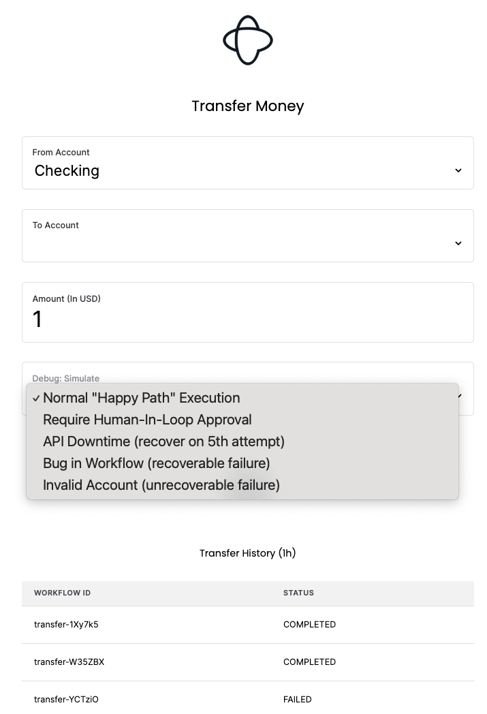

# Money Transfer Example

Demos various aspects of [Temporal](https://temporal.io) using the Typescript SDK.

https://transfer.tmprl-demo.cloud/

A [Java SDK version](https://github.com/steveandroulakis/temporal-money-transfer-java) of this example is also available.



## Configuration

(optional if using local Temporal dev server)

- `server/` contains `.env_example`. Copy it to `.env.development` and change settings to match your temporal installation.
- `STRIPE_SECRET_KEY` is optional (use if you want to run simulated charges against the Stripe API)
- `ui/` contains `.env_example`. Copy it to `.env.development` and change settings to point to your API (server) location (default is / which should be fine)
- The server respects .env.production if NODE_ENV is "production" (and the Svelte app is built using npm run build such as in the Dockerfile)

## Run a Workflow

Run a Temporal Server ([Guide](https://docs.temporal.io/kb/all-the-ways-to-run-a-cluster#temporal-cli))
- `brew install temporal`
- `temporal server start-dev` (Temporal Server web UI: localhost:8233)

Install Node dependencies:
- `cd server/`
- `npm install`

- `cd ui/`
- `npm install`

Run workers
- Run a workflow worker:
  - `cd server`
  - `npm run worker.workflow`

Run API and Web UI (localhost:3000)
- `nodemon /server/index.ts` (from the project root directory)

## Demo various failures and recoveries

A dropdown menu simulates the following scenarios

#### Happy Path
- The transfer will run to completion

#### Require Human-In-Loop Approval
The transfer will pause and wait for approval. If the user doesn't approve the transfer within a set time, the workflow will fail.

Approve a transfer using **Signals**

You can also do this through the `temporal` cli:
```bash
temporal workflow signal \
--query 'ExecutionStatus="Running" and WorkflowType="moneyTransferWorkflow"' \
--name approveTransfer \
--reason 'approving transfer'
```

Approve a transfer using **Updates** (COMING SOON)

You can do this through the `temporal` cli:
```bash
temporal workflow update \
 --env prod \
 --workflow-id TRANSFER-XXX-XXX \
 --name approveTransferUpdate
```

The workflow's Update function has a [validator](https://docs.temporal.io/dev-guide/java/features#validate-an-update). It will reject an Update if:
- The transfer isn't waiting for approval
- The transfer has already been approved

#### Simulate a Bug in the Workflow (recoverable failure)
In `./server/temporal/workflows.ts`, uncomment the line `// throw new Error('Workflow bug!');`. Re-comment it and restart the worker for the workflow to recover.

#### Simulate API Downtime (recover on 5th attempt)
Will introduce artifical delays in the `withdraw` activity's API calls. This will cause activity retries. After 5 retries, the delay will be removed and the workflow will proceed.

#### Insufficient Funds (unrecoverable failure)
Introduces an unrecoverable failure in the `deposit` activity (invalid account). The workflow will fail after running compensation activities (`undoWithdraw`).

#### Schedule a recurring transfer
Creates a [Schedule](https://docs.temporal.io/workflows#schedule) that will run a set of workflows on a cadence.

Produces a schedule ID, which you can inspect in the Temporal UI's "Schedules" menu.

#### List failed workflows
temporal workflow list --env prod -q 'ExecutionStatus="Failed" OR ExecutionStatus="Terminated"'

#### (Advanced) Debug/replay Workflow histories with the [Temporal VSCode Extension](https://marketplace.visualstudio.com/items?itemName=temporal-technologies.temporalio)
- Open /server as a VSCode project
- Run the replayer on a downloaded workflow JSON file
